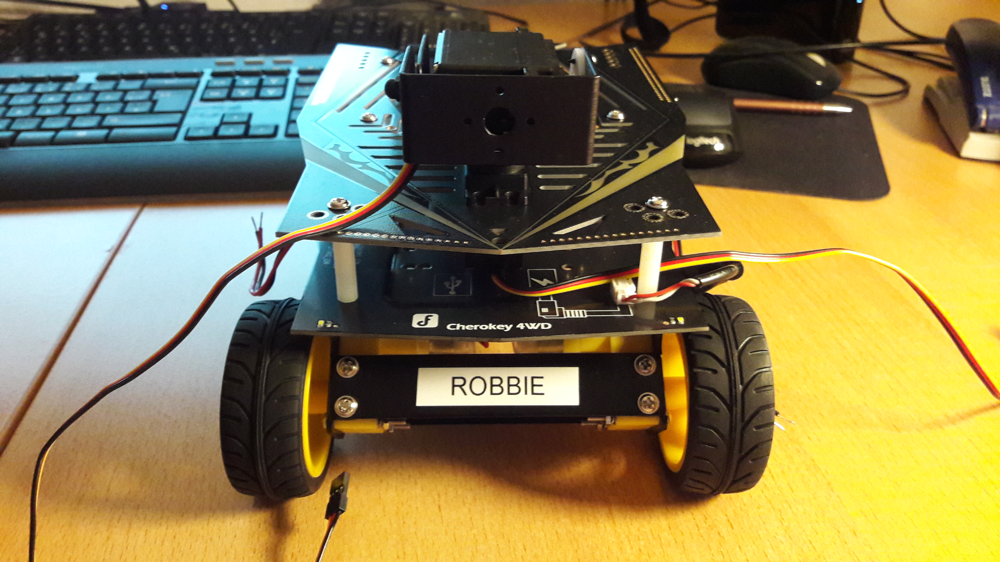

# Robbie 1
## A small robot project based on the DFRobot Cherokey-Frame
---

List of hardware currently used:

* DFRobots Cherokey Frame
* Raspberry Pi 3B
* Neato XV-11 LiDAR unit
* Arduino Nano 
* Arduino Pro Micro
* 2 18650-Li-ion batteries to power the motors
* 3 18650-Li-ion batteries to power RPI and MCUs (in form of Anker PowerCore 10Ah USB-power bank)

## Configuration of Robot
Four-wheel skid configuration. Motors are controlled by L298 motor driver. 

Frontal view of robot chassis with tilt-and-pan camera mount (currently not part of the project):

## Motor Control
The motors are controlled by a Arduino Nano MCU and L298 motor driver. All four wheels are powered by DC-motors.

## LiDAR Unit
The LiDAR unit has been extracted from a broken Neato robot.
We have chosen the Arduino Pro Micro, as its 32U4-chip comes with two UART units instead of only one on the Arduino Nano. One unit is used to communicate with the LiDAR and one to further transmit the LiDAR data to the RPI.

## Running roscore on the RPI
Current architecture:
<!--  -->

## Next Steps
* Configure udev on the RPI

## Literature and Links

[1]
[2] 
